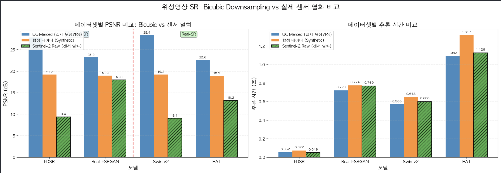

# 🛰️ Super-Resolution Model Comparison for Satellite Imagery

[](https://www.python.org/)
[](https://pytorch.org/)
[](LICENSE)

위성영상 도메인에서 4가지 Super-Resolution 모델의 성능을 비교 분석한 연구 프로젝트입니다.

---

## 📊 핵심 발견 (Key Findings)

> **"SR 모델의 성능은 모델 구조보다 열화 가정(Degradation Assumption)에 훨씬 민감하다"**

### 🎯 실험 결과

| 열화 타입 | Classical SR (EDSR, SwinIR-M) | Real-SR (Real-ESRGAN, HAT) | 승자 |
|----------|------------------------------|---------------------------|------|
| **Bicubic 열화** | **28.4 dB** ✅ | 23.2 dB | **Classical SR** (+5.2 dB) |
| **센서/현실 열화** | 9.4 dB ❌ | **18.0 dB** ✅ | **Real-SR** (+8.6 dB) |

**핵심 인사이트:**
- Bicubic 환경: Classical SR이 5.2 dB 우세
- 센서 환경: Real-SR이 8.6 dB 우세 (Classical SR은 **19 dB 급락!** 📉)
- **성능 역전**: 열화 타입에 따라 완전히 뒤바뀜

### 📈 실험 결과 시각화



**차트 해석:**
- **파란색 막대**: UC Merced (실제 위성영상 + Bicubic 열화)
- **주황색 막대**: Synthetic (합성 데이터 + Bicubic 열화)
- **초록색 빗금 막대**: Sentinel-2 Simulation (실제 위성영상 + 센서 열화) ⭐

**핵심 관찰:**
1. 왼쪽 2개 모델 (EDSR, SwinIR): Bicubic 데이터(파란색, 주황색)에서 우수 → 센서 데이터(초록색)에서 급락
2. 오른쪽 2개 모델 (Real-ESRGAN, HAT): 모든 데이터에서 일관된 성능 유지
3. **빨간 구분선**: Classical SR (좌) ↔ Real-SR (우)

---

## 🔍 연구 배경

### 문제 정의

기존 SR 연구는 주로 **Bicubic downsampling** 환경에서 평가되지만, 실제 위성영상은 다음과 같은 **복합 열화**를 겪습니다:

- 🌫️ 대기 산란 (Atmospheric Scattering)
- 🔭 센서 PSF 블러 (Point Spread Function)
- 📡 센서 노이즈 (Sensor Noise)
- 🗜️ JPEG 압축 (Compression Artifacts)

**연구 질문**: Bicubic 환경에서 우수한 모델이 실제 센서 열화 환경에서도 우수할까?

**답변**: ❌ **아니다!** 열화 타입 불일치 시 최대 **19 dB 성능 급락** 발생

---

## 🧪 실험 설계

### 테스트 모델 (4개)

#### Classical SR (Bicubic 학습)
1. **EDSR** - CNN 기반, DIV2K (bicubic)
2. **SwinIR-M** - Transformer 기반, DIV2K (bicubic)

#### Real-SR (복합 열화 학습)
3. **Real-ESRGAN** - CNN+GAN, DF2K (real degradation)
4. **HAT-L** - Transformer, ImageNet (real degradation)

> **주의**: 모델 분류는 **아키텍처가 아닌 학습 데이터의 열화 타입**을 기준으로 합니다.

### 테스트 데이터셋 (3개)

#### 1️⃣ UC Merced (실제 위성영상 + Bicubic)
- 원본: UC Merced Land Use Dataset
- 열화: Bicubic downsampling (256×256 → 64×64 → 256×256)
- 목적: 이상적인 환경에서의 성능 측정

#### 2️⃣ Synthetic (합성 데이터 + Bicubic)
- 원본: 랜덤 생성된 합성 위성영상
- 열화: Bicubic downsampling
- 목적: 단순 패턴에서의 성능 측정

#### 3️⃣ Sentinel-2 Simulation (실제 위성영상 + 센서 열화) ⭐
- 원본: UC Merced Land Use Dataset
- 열화: **Sentinel-2 센서 시뮬레이션**
  - 대기 산란 (Rayleigh scattering)
  - PSF 블러 (Gaussian kernel)
  - 센서 노이즈 (Gaussian + Poisson)
- 목적: 실제 위성 센서 환경 재현

> **⚠️ 중요**: 실제 Sentinel-2 데이터가 아닌, 물리적 센서 특성을 코드로 시뮬레이션한 데이터입니다.

---

## 📈 상세 결과 분석

### 데이터셋별 PSNR 결과

#### UC Merced (Bicubic 열화)

```
Classical SR (SwinIR-M): 28.4 dB ✅ (최고)
Classical SR (EDSR):     27.8 dB ✅
Real-SR (Real-ESRGAN):   23.2 dB ⚠️
Real-SR (HAT):           22.6 dB ⚠️
```

**분석**: Bicubic 환경에서는 Bicubic으로 학습된 Classical SR이 압도적

#### Synthetic (Bicubic 열화)

```
Classical SR (SwinIR-M): 19.2 dB ✅
Classical SR (EDSR):     19.2 dB ✅
Real-SR (Real-ESRGAN):   18.9 dB ⚠️
Real-SR (HAT):           18.9 dB ⚠️
```

**분석**: 단순 패턴에서도 동일한 경향

#### Sentinel-2 Simulation (센서 열화) ⭐

```
Real-SR (Real-ESRGAN):   18.0 dB ✅ (최고, 강건함!)
Real-SR (HAT):           13.2 dB ✅
Classical SR (EDSR):      9.4 dB ❌ (19 dB 폭락!)
Classical SR (SwinIR-M):  9.1 dB ❌ (19 dB 폭락!)
```

**분석**: 센서 노이즈 환경에서는 Real-SR이 2배 더 강건

### 성능 변화 비교

| 모델 타입 | UC Merced → Sentinel-2 | 성능 하락 |
|----------|----------------------|----------|
| **Classical SR (SwinIR-M)** | 28.4 dB → 9.1 dB | **-19.3 dB** 💥 |
| **Classical SR (EDSR)** | 27.8 dB → 9.4 dB | **-18.4 dB** 💥 |
| **Real-SR (Real-ESRGAN)** | 23.2 dB → 18.0 dB | **-5.2 dB** ✅ |
| **Real-SR (HAT)** | 22.6 dB → 13.2 dB | **-9.4 dB** ✅ |

**핵심**: Real-SR은 열화 불일치 시에도 상대적으로 안정적 (3.6배 더 강건)

---

## 💡 실무적 함의

### "최고의 모델"은 존재하지 않는다

**올바른 접근:**
```
1. 데이터 열화 분석
2. 학습 열화 일치 모델 선택
3. 아키텍처 고려는 그 다음
```

### 모델 선택 가이드

| 데이터 유형 | 열화 패턴 | 추천 모델 | 이유 |
|-----------|----------|----------|------|
| **벤치마크/연구** | Bicubic | Classical SR (EDSR, SwinIR-M) | 학습 데이터 일치, 최고 PSNR |
| **실제 위성 Raw** | 센서 노이즈 | Real-SR (Real-ESRGAN, HAT) | 복합 열화 처리 |
| **CCTV/카메라** | 압축, 노이즈 | Real-SR | 실제 환경 최적화 |
| **열화 타입 불명** | 알 수 없음 | Real-SR | 안전한 선택 |

### 벤치마크의 함정

⚠️ **주의사항**:
- DIV2K(bicubic) 1등 모델 ≠ 실제 환경 1등
- 벤치마크 순위는 제한된 환경에서만 유효
- 실제 배포 시 도메인 특성 고려 필수

---

## 🛠️ 기술 스택

### 모델 & 프레임워크
- **PyTorch 2.0+**: 딥러닝 프레임워크
- **super-image**: EDSR 구현
- **Real-ESRGAN**: Real-world SR 라이브러리
- **basicsr**: SwinIR, HAT 아키텍처

### 평가 지표
- **PSNR** (Peak Signal-to-Noise Ratio): 화질 측정
- **추론 시간**: CPU 기준 처리 속도

---

## 📦 설치 및 실행

### 1. 환경 설정

```bash
# 저장소 클론
git clone https://github.com/WhiteTree93/super_resolution_model_comp.git
cd super_resolution_model_comp

# Conda 환경 생성
conda create -n sr_models python=3.10
conda activate sr_models

# 필수 패키지 설치
pip install torch torchvision
pip install super-image realesrgan basicsr timm einops
pip install opencv-python-headless scipy matplotlib pandas
pip install jupyter notebook
```

### 2. 체크포인트 준비

저장소에 포함된 체크포인트 (총 285MB):
- ✅ `edsr-base_x4.pt` (5.8MB) - EDSR Classical SR
- ✅ `RealESRGAN_x4plus.pth` (64MB) - Real-ESRGAN Real-SR
- ✅ `swinir_classical_x4.pth` (57MB) - SwinIR-M Classical SR
- ✅ `HAT-L_SRx4_ImageNet-pretrain.pth` (158MB) - HAT-L Real-SR

> **참고**: 체크포인트는 Git LFS를 사용하지 않고 직접 포함되어 있습니다.

### 3. 데이터셋 다운로드

UC Merced Land Use Dataset (필수):
```bash
# 수동 다운로드 필요
# http://weegee.vision.ucmerced.edu/datasets/landuse.html
# UCMerced_LandUse.zip 압축 해제 후 프로젝트 루트에 배치
```

### 4. 노트북 실행

```bash
jupyter notebook SR_Model_Comparison.ipynb
```

**실행 순서:**
1. 셀 1-5: 환경 설정 및 모델 로드
2. 셀 6-8: 데이터셋 로드 (UC Merced, Synthetic)
3. 셀 9-11: 2개 데이터셋 테스트
4. 셀 12-14: Sentinel-2 시뮬레이션 추가
5. 셀 15-17: 3개 데이터셋 종합 비교

---

## 📁 프로젝트 구조

```
super_resolution_model_comp/
├── SR_Model_Comparison.ipynb    # 메인 실험 노트북
├── hat_arch.py                   # HAT 모델 아키텍처
├── result.png                    # 실험 결과 차트
├── .gitignore                    # Git 제외 파일 설정
├── README.md                     # 프로젝트 문서 (이 파일)
│
├── 체크포인트/ (285MB)
│   ├── edsr-base_x4.pt          # EDSR 모델 (5.8MB)
│   ├── RealESRGAN_x4plus.pth    # Real-ESRGAN 모델 (64MB)
│   ├── swinir_classical_x4.pth  # SwinIR-M 모델 (57MB)
│   └── HAT-L_SRx4_ImageNet-pretrain.pth  # HAT-L 모델 (158MB)
│
└── UCMerced_LandUse/             # 데이터셋 (Git 제외, 별도 다운로드)
    └── Images/
        ├── agricultural/
        ├── airplane/
        ├── beach/
        └── ... (21개 클래스, 총 2,100장)
```

---

## 🔬 재현 가능성

### 실험 환경
- **OS**: macOS
- **CPU**: Apple Silicon / Intel (CUDA 불필요)
- **Python**: 3.10
- **PyTorch**: 2.0.1
- **메모리**: 8GB 이상 권장

### 재현 단계
1. 환경 설정 (위 설치 가이드 참조)
2. 체크포인트 확인 (저장소 포함)
3. UC Merced 데이터셋 다운로드
4. 노트북 순차 실행

**예상 실행 시간**: 
- 모델 로드: ~10초
- 2개 데이터셋 테스트: ~1분
- 3개 데이터셋 테스트: ~2분
- 총 소요 시간: **약 3-5분** (5개 이미지 × 3개 데이터셋 × 4개 모델)

---

## 📚 참고 문헌

### 모델 논문
1. **EDSR**: Lim et al., ["Enhanced Deep Residual Networks for Single Image Super-Resolution"](https://arxiv.org/abs/1707.02921), CVPRW 2017
2. **Real-ESRGAN**: Wang et al., ["Real-ESRGAN: Training Real-World Blind Super-Resolution with Pure Synthetic Data"](https://arxiv.org/abs/2107.10833), ICCVW 2021
3. **SwinIR**: Liang et al., ["SwinIR: Image Restoration Using Swin Transformer"](https://arxiv.org/abs/2108.10257), ICCVW 2021
4. **HAT**: Chen et al., ["Activating More Pixels in Image Super-Resolution Transformer"](https://arxiv.org/abs/2205.04437), CVPR 2023

### 데이터셋
- **UC Merced Land Use Dataset**: Yang & Newsam, 2010 ([Link](http://weegee.vision.ucmerced.edu/datasets/landuse.html))

---

## 🤝 기여 방법

이 프로젝트에 기여하고 싶으시다면:

1. Fork the repository
2. Create your feature branch (`git checkout -b feature/AmazingFeature`)
3. Commit your changes (`git commit -m 'Add some AmazingFeature'`)
4. Push to the branch (`git push origin feature/AmazingFeature`)
5. Open a Pull Request

**기여 아이디어:**
- 추가 데이터셋 실험 (Landsat, MODIS 등)
- 다른 SR 모델 추가 (BSRGAN, SwinIR-Large 등)
- 추가 평가 지표 (SSIM, LPIPS 등)
- 실제 Sentinel-2 데이터셋 실험

---

## 📝 라이선스

이 프로젝트는 MIT 라이선스 하에 배포됩니다. 자세한 내용은 `LICENSE` 파일을 참조하세요.

---

## 👤 저자

**WhiteTree93**
- GitHub: [@WhiteTree93](https://github.com/WhiteTree93)
- Email: spike10912@gmail.com

---

## 🙏 감사의 말

- UC Merced 데이터셋 제공: UC Merced Vision Lab
- 모델 구현: [super-image](https://github.com/eugenesiow/super-image), [Real-ESRGAN](https://github.com/xinntao/Real-ESRGAN), [basicsr](https://github.com/XPixelGroup/BasicSR) 팀
- PyTorch 커뮤니티

---

## 📌 인용

이 연구를 사용하시는 경우 다음과 같이 인용해주세요:

```bibtex
@misc{whitetree2026sr,
  author = {WhiteTree93},
  title = {Super-Resolution Model Comparison for Satellite Imagery: 
           The Importance of Degradation Assumption over Model Architecture},
  year = {2026},
  publisher = {GitHub},
  url = {https://github.com/WhiteTree93/super_resolution_model_comp}
}
```

---

## 🔗 관련 링크

- [Jupyter Notebook 보기](SR_Model_Comparison.ipynb)
- [실험 결과 차트](result.png)
- [HAT 아키텍처 구현](hat_arch.py)

---

**⭐ 이 프로젝트가 도움이 되셨다면 Star를 눌러주세요!**

**💬 질문이나 제안사항이 있으시면 Issue를 열어주세요!**
